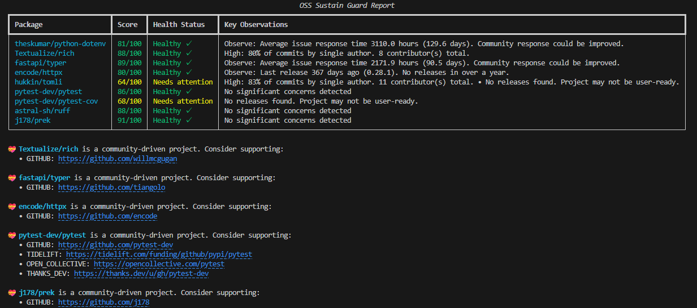

# OSS Sustain Guard

[](https://github.com/onukura/oss-sustain-guard/actions/workflows/test.yml)
[](https://pypi.org/project/oss-sustain-guard/)
[](https://opensource.org/licenses/MIT)

**Multi-language package sustainability analyzer** - Evaluate your dependencies' health with 9 key metrics including Bus Factor, Maintainer Activity, and Security Posture.

✨ **No API tokens required** - Fast, cache-based evaluation for Python, JavaScript, Go, Rust, PHP, Java, C#, and Ruby packages.

## 💡 Project Philosophy

OSS Sustain Guard is designed to spark thoughtful conversations about open-source sustainability, not to pass judgment on projects. Our mission is to **raise awareness** about the challenges maintainers face and encourage the community to think together about how we can better support the open-source ecosystem.

We believe that:

- 🌱 **Sustainability matters** - Open-source projects need ongoing support to thrive
- 🤝 **Community support is essential** - For community-driven projects, we highlight funding opportunities to help users give back
- 📊 **Transparency helps everyone** - By providing objective metrics, we help maintainers and users make informed decisions
- 🎯 **Respectful evaluation** - We distinguish between corporate-backed and community-driven projects, recognizing their different sustainability models
- 💝 **Supporting maintainers** - When available, we display funding links for community projects to encourage direct support

This tool is meant to be a conversation starter about OSS sustainability, not a judgment. Every project has unique circumstances, and metrics are just one part of the story.

## 🎯 Key Features

- **9 Sustainability Metrics** - Bus Factor, Maintainer Drain, Release Cadence, Security, and more
- **Multi-Language Support** - Python, JavaScript, Go, Rust, PHP, Java, C#, Ruby
- **Community Support Awareness** - Displays funding links for community-driven projects
- **Fast & Cache-Based** - Pre-computed data for instant results
- **CI/CD Integration** - GitHub Actions, Pre-commit hooks
- **Zero Configuration** - Works out of the box

## 🚀 Quick Start

```bash
# Install
pip install oss-sustain-guard

# Check a package
oss-guard check requests

# Check multiple ecosystems
oss-guard check python:django npm:react rust:tokio

# Auto-detect from lock files
oss-guard check --include-lock
```



## 📖 Usage

### Command Line

```bash
# Single package
oss-guard check flask

# Multiple packages
oss-guard check django requests numpy

# From requirements.txt
oss-guard check requirements.txt

# Verbose output
oss-guard check flask -v

# Clear cache
oss-guard check --clear-cache
```

**Community Funding Support:**

When analyzing community-driven projects, OSS Sustain Guard displays funding links to help you support the maintainers:

```bash
$ oss-guard check go:gorm

OSS Sustain Guard Report
┌──────────────┬────────┬──────┬────────────────────────────────────────────┐
│ Package      │ Score  │ Risk │ Details                                    │
├──────────────┼────────┼──────┼────────────────────────────────────────────┤
│ go-gorm/gorm │ 89/100 │ None │ Analyzed: Healthy: 58 active contributors. │
└──────────────┴────────┴──────┴────────────────────────────────────────────┘

💝 go-gorm/gorm is a community-driven project. Consider supporting:
   • GITHUB: https://github.com/jinzhu
   • PATREON: https://patreon.com/jinzhu
   • OPEN_COLLECTIVE: https://opencollective.com/gorm
```

Corporate-backed projects (e.g., maintained by organizations) do not display funding links, as they typically have different sustainability models.

### Multi-Language Support

```bash
# Specify ecosystem with prefix
oss-guard check npm:react              # JavaScript
oss-guard check rust:tokio             # Rust
oss-guard check ruby:rails             # Ruby
oss-guard check go:github.com/gin-gonic/gin  # Go
oss-guard check php:symfony/console    # PHP
oss-guard check java:com.google.guava:guava  # Java
oss-guard check csharp:Newtonsoft.Json # C#

# Mix multiple ecosystems
oss-guard check requests npm:express rust:tokio

# Auto-detect from manifest files in current directory
oss-guard check

# Analyze a specific manifest file
oss-guard check --manifest package.json
oss-guard check --manifest requirements.txt
oss-guard check -m Cargo.toml

# Auto-detect from specific directory
oss-guard check --root-dir /path/to/project

# Auto-detect with lock files
oss-guard check --include-lock
```

**Supported Ecosystems:**

| Ecosystem | Format | Example |
|-----------|--------|---------|
| Python | `python:package` or `package` | `requests`, `python:flask` |
| JavaScript | `npm:package`, `js:package` | `npm:react`, `js:vue` |
| Go | `go:path` | `go:github.com/golang/go` |
| Ruby | `ruby:gem`, `gem:gem` | `ruby:rails`, `gem:devise` |
| Rust | `rust:crate` | `rust:tokio` |
| PHP | `php:vendor/package` | `php:symfony/console` |
| Java | `java:groupId:artifactId` | `java:com.google.guava:guava` |
| C# | `csharp:package`, `nuget:package` | `csharp:Serilog` |

### GitHub Actions

Add to your workflow:

```yaml
- uses: onukura/oss-sustain-guard@main
  with:
    packages: 'requests django'
    verbose: 'true'
```

Or auto-detect from lock files:

```yaml
- uses: onukura/oss-sustain-guard@main
  with:
    include-lock: 'true'
```

**Multi-language example:**

```yaml
- uses: onukura/oss-sustain-guard@main
  with:
    packages: 'requests npm:express ruby:rails rust:tokio'
    verbose: 'true'
```

See [GitHub Actions Guide](./docs/GITHUB_ACTIONS_GUIDE.md) for details.

### Pre-Commit Hooks

Add to `.pre-commit-config.yaml`:

```yaml
repos:
  - repo: https://github.com/onukura/oss-sustain-guard
    rev: 'main'
    hooks:
      - id: oss-sustain-guard
        args: ['--include-lock']
```

Install and run:

```bash
pip install pre-commit
pre-commit install
pre-commit run oss-sustain-guard --all-files
```

See [Pre-Commit Integration Guide](./docs/PRE_COMMIT_INTEGRATION.md) for details.

## 💾 Cache Management

Caches analysis data locally (default: `~/.cache/oss-sustain-guard`, 7-day TTL).

```bash
# Custom cache directory
oss-guard check requests --cache-dir /path/to/cache

# Custom TTL (seconds)
oss-guard check requests --cache-ttl 86400

# Disable cache
oss-guard check requests --no-cache

# Clear cache
oss-guard check --clear-cache

# View cache statistics
oss-guard cache-stats
```

Configure in `.oss-sustain-guard.toml`:

```toml
[tool.oss-sustain-guard.cache]
directory = "~/.cache/oss-sustain-guard"
ttl_seconds = 604800  # 7 days
enabled = true
```

## 📊 Score Explanation

Scores are evaluated in the range of 0-100:

- **80-100**: 🟢 **Excellent** - Healthy project
- **50-79**: 🟡 **Caution** - Areas needing improvement
- **0-49**: 🔴 **Critical** - Severe risks

### Metrics Details

| Metric | Max Score | Description |
|--------|----------|------|
| Bus Factor | 20 | Single maintainer dependency |
| Maintainer Drain | 10 | Long-inactive maintainers |
| Zombie Check | 20 | Inactive repository detection |
| Merge Velocity | 10 | Merge processing speed |
| CI Status | 5 | Automated test coverage |
| Funding | 10 | Sponsorship status (more critical for community-driven projects) |
| Release Cadence | 10 | Release frequency |
| Security Posture | 15 | Security configuration and alerts |
| Community Health | 5 | Issue response time |

**Note on Funding Metric:** This metric is scored differently based on project type:

- **Community-driven projects** (max 10 points): Funding sources are essential for sustainability. Projects with active funding (GitHub Sponsors, Patreon, Open Collective, etc.) score higher.
- **Corporate-backed projects** (max 5 points): Funding is less critical as corporate backing provides sustainability. The metric acknowledges organizational support.

## ⚙️ Configuration

**Exclude packages** - Create `.oss-sustain-guard.toml`:

```toml
[tool.oss-sustain-guard]
exclude = ["internal-package", "legacy-dependency"]
```

**GitHub token** - For non-cached packages (optional):

```bash
export GITHUB_TOKEN=your_github_token
```

See [Exclude Packages Guide](./docs/EXCLUDE_PACKAGES_GUIDE.md) for details.

## 🤝 Contributing

See [CONTRIBUTING.md](./CONTRIBUTING.md) for development setup, testing, code style, and architecture documentation.

## 📝 Documentation

- [Database Schema](./docs/DATABASE_SCHEMA.md) - JSON database format
- [Pre-Commit Integration](./docs/PRE_COMMIT_INTEGRATION.md) - Hook configuration
- [GitHub Actions Guide](./docs/GITHUB_ACTIONS_GUIDE.md) - CI/CD setup
- [Exclude Packages Guide](./docs/EXCLUDE_PACKAGES_GUIDE.md) - Package filtering

## 📄 License

MIT License
