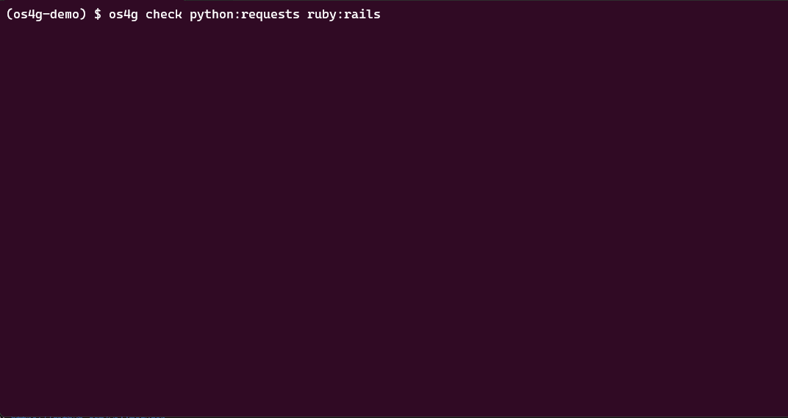

# OSS Sustain Guard

[](https://github.com/onukura/oss-sustain-guard/actions/workflows/test.yml)
[](https://pypi.org/project/oss-sustain-guard/)
[](https://pypi.org/project/oss-sustain-guard/)
[](https://opensource.org/licenses/MIT)
[](https://onukura.github.io/oss-sustain-guard/)



Note: Demo shows a warm cache; first run may take longer depending on API response time.

**Multi-language package sustainability analyzer** - Evaluate your dependencies' health with 24 core metrics (plus optional dependents) including Contributor Redundancy, Maintainer Retention, and Security Signals.

## Why OSS Sustain Guard?

Every time a high-profile OSS incident makes the news, I find myself wondering about the packages I rely on right now. I could visit GitHub and skim issues, pull requests, and activity to get a rough sense, but it is not easy. When you depend on tens or hundreds of packages, plus their dependencies, it becomes nearly impossible, and you usually do not notice until something goes wrong.

The libraries that support my work might be under heavy strain, and their own dependencies might be too. OSS Sustain Guard was built to answer those questions and to create moments where users can see the state of maintainers and communities. The first step is simple awareness.

## 💡 Project Philosophy

OSS Sustain Guard uses empathetic language and contextual metrics to help teams support the projects they rely on. We avoid judgment and recognize that sustainability looks different across communities and organizations.

We believe that:

- 🌱 **Sustainability matters** - Open-source projects need ongoing support to thrive
- 🤝 **Community support is essential** - For community-driven projects, we highlight funding opportunities to help users give back
- 📊 **Transparency helps everyone** - By providing objective metrics, we help maintainers and users make informed decisions
- 🎯 **Respectful evaluation** - We distinguish between corporate-backed and community-driven projects, recognizing their different sustainability models
- 💝 **Supporting maintainers** - When available, we display funding links for community projects to encourage direct support

Metrics are one lens among many; they work best alongside project context and real-world knowledge.

## 🎯 Key Features

- **24 Core Sustainability Metrics** - Comprehensive evaluation across maintainer health, development activity, community engagement, project maturity, and security (all core metrics scored 0-10)
- **Pluggable Metrics System** - Easily extend analysis by adding your own sustainability metrics as plugins.
- **Optional Dependents Analysis** - Adds a downstream dependents metric when enabled with `--enable-dependents` (requires `LIBRARIESIO_API_KEY`)
- **5 CHAOSS-Aligned Models** - Stability, Sustainability, Community Engagement, Project Maturity, and Contributor Experience
- **Metric-Weighted Scoring** - Configurable scoring profiles with integer weights per metric, normalized to 0-100 scale
- **Custom Scoring Profiles** - Define your own scoring profiles to tailor evaluation priorities for your organization or use case.
- **Multi-Language Support** - Python, JavaScript, Go, Rust, PHP, Java, Kotlin, C#, Ruby
- **Community Support Awareness** - Displays funding links for community-driven projects
- **Local Caching** - Efficient local cache for faster repeated checks
- **CI/CD Integration** - GitHub Actions, Pre-commit hooks
- **Minimal Setup** - Requires a GitHub token for most repos; a GitLab token is only needed when the source is on gitlab.com (use `--demo` to try it without one)

## 🔒 Privacy & Security

**Your data stays local:**

- ✅ **GitHub/GitLab token usage** - Your `GITHUB_TOKEN` or `GITLAB_TOKEN` is used **only** for real-time API queries on the matching host
  - Data flows directly from the GitHub/GitLab API → your machine
  - Token is **not** stored, logged, or sent anywhere except the host's official API
  - GitHub scopes: `public_repo` and `security_events` (read-only access)
  - GitLab scopes: `read_api` and `read_repository`

- ✅ **Local caching** - Analysis results are cached locally in `~/.cache/oss-sustain-guard/`
  - No cloud storage or external uploads
  - You control the cache directory and can clear it anytime with `os4g clear-cache`
  - Cache files are standard JSON (human-readable) with TTL metadata

- ✅ **Analysis is transparent** - All metrics are calculated client-side from public GitHub or GitLab data
  - No proprietary scoring sent to external services
  - No profiling or telemetry
  - Open-source metric implementations for full audit

**API Limits & Sampling:**

For performance reasons, we sample GitHub data with these limits (per analysis):
- **Commits**: Last 100 analyzed
- **Pull Requests**: Last 50 merged + last 50 closed sampled
- **Issues**: Last 20 open + last 50 closed sampled
- **Releases**: Last 10 analyzed

These samples are sufficient for evaluating sustainability trends. Results include **sample counts** so you can see exactly what data was used. For large projects with high activity, these limits mean you're seeing representative data rather than exhaustive data—which is intentional for API efficiency and speed.

## 🚀 Quick Start

```bash
# Install
pip install oss-sustain-guard

# Try built-in demo data (no token required)
os4g check --demo
# Demo data is a snapshot for illustration and may differ from current repository status.

# Set GitHub token (classic) with public_repo and security_events scopes
export GITHUB_TOKEN='your_token_here'  # Get from: https://github.com/settings/tokens/new

# For GitLab-hosted repos (gitlab.com), set GITLAB_TOKEN with read_api and read_repository scopes
export GITLAB_TOKEN='your_token_here'  # Get from: https://gitlab.com/-/user_settings/personal_access_tokens

# Real-time analysis supports GitHub and GitLab (gitlab.com) repositories

# Check your dependencies (auto-detect from manifest files)
os4g check

# Check your dependencies including lock files
os4g check --include-lock

# Scan recursively (great for monorepos)
os4g check --recursive

# Check a single package
os4g check requests

# Check multiple packages (auto-detect language)
os4g check django flask numpy

# Multi-language support
os4g check python:requests npm:react rust:tokio r:ggplot2 haskell:text swift:apple/swift-nio

# Export results to JSON
os4g check requests --output-format json --output-file oss-report.json

# Generate an HTML report
os4g check requests --output-format html --output-file oss-report.html
```

## 📚 Documentation

For detailed usage, configuration, and features, see our documentation site:

- **[Getting Started](https://onukura.github.io/oss-sustain-guard/GETTING_STARTED/)** - Installation and basic usage
- **[Scoring Profiles](https://onukura.github.io/oss-sustain-guard/SCORING_PROFILES_GUIDE/)** - Different evaluation perspectives
- **[GitHub Actions Integration](https://onukura.github.io/oss-sustain-guard/GITHUB_ACTIONS_GUIDE/)** - CI/CD setup
- **[Pre-Commit Hooks](https://onukura.github.io/oss-sustain-guard/PRE_COMMIT_INTEGRATION/)** - Automated checks
- **[Exclude Packages](https://onukura.github.io/oss-sustain-guard/EXCLUDE_PACKAGES_GUIDE/)** - Configuration
- **[FAQ](https://onukura.github.io/oss-sustain-guard/TROUBLESHOOTING_FAQ/)** - Common questions

### Supported Ecosystems

Python, JavaScript, Go, Rust, PHP, Java, Kotlin, C#, Ruby, R, Haskell, Swift, Dart, Elixir, Perl

See [Getting Started](https://onukura.github.io/oss-sustain-guard/GETTING_STARTED/) for ecosystem-specific syntax.

#### Repository Source Handling

- **GitHub-hosted repositories**: ✅ Full real-time analysis supported (requires `GITHUB_TOKEN`)
- **GitLab-hosted repositories (gitlab.com)**: ✅ Real-time analysis supported (requires `GITLAB_TOKEN`)
  - If CI data is not available, Build Health is listed under skipped metrics.
- **Other hosts** (Gitea, SourceForge, etc.): ℹ️ Detected and skipped
  - The tool will display a note indicating the repository host and skip real-time analysis.

### 24 Core Sustainability Metrics

Evaluated across 5 categories:

- **Maintainer Health** (25%) - Contributor diversity and retention
- **Development Activity** (20%) - Release rhythm and recent activity
- **Community Engagement** (20%) - Issue/PR responsiveness
- **Project Maturity** (15%) - Documentation and governance
- **Security & Funding** (20%) - Security posture and sustainability

Optional dependents analysis adds a separate metric when enabled with `--enable-dependents` (requires `LIBRARIESIO_API_KEY`).

**Score interpretation:** 80-100 (Healthy) | 50-79 (Monitor) | 0-49 (Needs support)

### Special Features

- **🎁 Gratitude Vending Machine** - Discover community projects that need support

  ```bash
  os4g gratitude --top 5
  ```

- **💰 Community Funding Links** - Auto-displays funding options for community-driven projects

## 🤝 Contributing

See [CONTRIBUTING.md](./CONTRIBUTING.md) for development setup, testing, code style, and architecture documentation.

## 📝 Documentation

- [Scoring Profiles Guide](./docs/SCORING_PROFILES_GUIDE.md) - Different evaluation perspectives
- [Custom Metrics Guide](./docs/CUSTOM_METRICS_GUIDE.md) - Create your own sustainability metrics
- [Pre-Commit Integration](./docs/PRE_COMMIT_INTEGRATION.md) - Hook configuration
- [GitHub Actions Guide](./docs/GITHUB_ACTIONS_GUIDE.md) - CI/CD setup
- [Exclude Packages Guide](./docs/EXCLUDE_PACKAGES_GUIDE.md) - Package filtering

## 📄 License

MIT License
