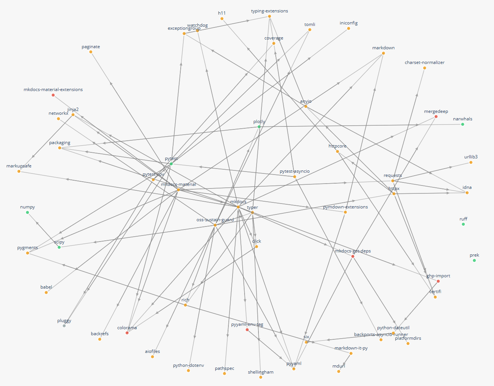

# Dependency Graph Visualization Guide

The `graph` command visualizes your project's dependency network with health scores. Supports HTML visualization and JSON export.

## Requirements

- Lockfile (see [Dependency Analysis Guide](DEPENDENCY_ANALYSIS_GUIDE.md) for formats)
- GitHub/GitLab token (`GITHUB_TOKEN` or `GITLAB_TOKEN`)

## Basic Usage

```bash
# Generate HTML graph (default)
os4g graph package-lock.json

# Custom output
os4g graph uv.lock --output deps.html
os4g graph Cargo.lock --output deps.json
```

## HTML Output example



## Options

| Option | Description |
|--------|-------------|
| `--output`, `-o` | Output file (default: `dependency_graph.html`) |
| `--direct-only` | Direct dependencies only (exclude transitive) |
| `--max-depth N` | Limit tree depth (1=direct, 2=direct+1st transitive, etc.) |
| `--profile` | Scoring profile: `balanced`, `security_first`, `contributor_experience`, `long_term_stability` |
| `--profile-file` | Custom TOML profile |
| `--scan-depth` | Data sampling: `shallow`, `default`, `deep`, `very_deep` |
| `--days-lookback N` | Analyze activity from last N days |
| `--no-cache` | Real-time analysis (skip cache) |
| `--num-workers N` | Parallel workers (default: 5) |
| `--verbose` | Detailed logging |

**Examples:**

```bash
os4g graph package.json --direct-only --output direct-deps.html
os4g graph Cargo.lock --max-depth 2 --profile security_first
os4g graph uv.lock --scan-depth shallow --num-workers 3
```

### Caching & Performance

| Option | Description |
|--------|-------------|
| `--no-cache` | Perform real-time analysis (skip cache, slower) |
| `--no-local-cache` | Skip local cache but use built-in defaults |
| `--cache-dir` | Custom cache directory path |
| `--cache-ttl` | Cache validity period in seconds (default: 604,800 = 7 days) |

**Examples:**

```bash
# Bypass cache for fresh data
os4g graph uv.lock --no-cache

# Use custom cache location
os4g graph Cargo.lock --cache-dir /tmp/my-cache
```

### Data Sampling & Scope

| Option | Description |
|--------|-------------|
| `--scan-depth` | Data sampling level: `shallow`, `default`, `deep`, `very_deep` |
| `--days-lookback` | Only analyze activity from the last N days |

**Examples:**

```bash
# Quick scan with minimal API calls
os4g graph package-lock.json --scan-depth shallow

# Comprehensive analysis with maximum detail
os4g graph requirements.txt --scan-depth very_deep

# Only analyze recent activity (last 90 days)
os4g graph Cargo.lock --days-lookback 90
```

### SSL & Network

| Option | Description |
|--------|-------------|
| `--insecure` | Disable SSL certificate verification (development only) |
| `--ca-cert` | Path to custom CA certificate file |

**Examples:**

```bash
# For development environments with custom SSL
os4g graph package.json --ca-cert /etc/ssl/my-ca.crt

# Disable SSL verification (not recommended for production)
os4g graph uv.lock --insecure
```

### Verbosity & Debugging

| Option | Description |
|--------|-------------|
| `--verbose`, `-v` | Enable detailed logging (cache operations, API calls, etc.) |
| `--num-workers` | Parallel analysis workers (default: 5) |

**Examples:**

```bash
# See detailed analysis progress and cache info
os4g graph Cargo.lock --verbose

# Increase parallelism for faster analysis
os4g graph package-lock.json --num-workers 10
```

## Output Formats

**HTML** (default): Interactive visualization with color-coded health scores

- 🟢 Green (≥80): Healthy
- 🟡 Yellow (50-79): Monitor
- 🔴 Red (<50): Needs support

**JSON**: Export for integration with other tools

```bash
os4g graph package.json --output deps.json
```

## Interpreting Results

- **🟢 Green (≥80)**: Healthy, well-maintained
- **🟡 Yellow (50-79)**: Monitor for updates
- **🔴 Red (<50)**: Needs support

For security-focused analysis, use `--profile security_first`. For contributor experience, use `--profile contributor_experience`.

## Troubleshooting

**Unable to analyze dependencies**: Try with fewer workers (`--num-workers 2`) or use shallow scan (`--scan-depth shallow`)

**Graph data is empty**: Remove `--direct-only` flag or increase `--max-depth`

**Slow analysis**: Use `--scan-depth shallow` and/or `--direct-only`

## See Also

- [Dependency Analysis Guide](DEPENDENCY_ANALYSIS_GUIDE.md) - Using `--show-dependencies` flag
- [Scoring Profiles Guide](SCORING_PROFILES_GUIDE.md) - Custom scoring
- [Caching Guide](CACHING_GUIDE.md) - Performance optimization

## API Tokens

Set environment variables for analysis:

```bash
export GITHUB_TOKEN=ghp_xxxxxxxxxxxx      # For GitHub
export GITLAB_TOKEN=glpat_xxxxxxxxxx      # For GitLab

os4g graph package-lock.json
```
